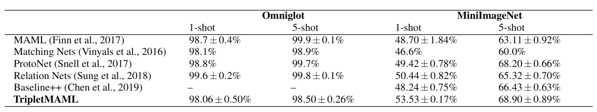
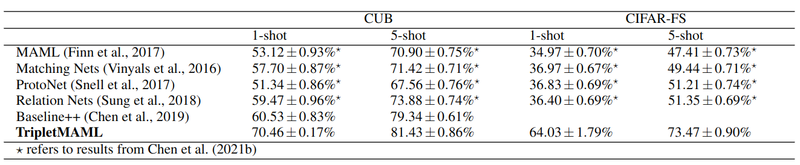

# TripletMAML: A metric-based model-agnostic meta-learning algorithm for few-shot classification

Implementation based on learn2learn meta-learning library: https://github.com/learnables/learn2learn

This repository includes codes for a new algorithm called TripletMAML which extends the Model-Agnostic Meta-Learning (MAML) algorithm from a metric-learning perspective. The same optimization procedure of MAML is adopted, but the neural network model is replaced with a triplet network which enables the utilization of metric-learning through the embeddings.

## TripletMAML

In our TripletMAML implementation, we adopted the shallow four-block CNN (CNN-4) architecture of MAML (Finn et al., 2017) which consists of four blocks, each comprising a 64-filter
3 × 3 convolution, a batch normalization layer, a ReLU nonlinearity and a 2 × 2 max-pooling layer. Also, we have modified the final layer to consider both metric loss and classification loss. 

Use "tripletmaml_train_test_val.py" to train TripletMAML using one of the predefined models. 

In order to set the hyper-parameter values of TripletMAML for different benchmark datasets, we made use of the literature studies that provide an extension to MAML and use the same
CNN-4 backbone. These hyper-parameters are: 

Triplet_Model_Parameter = {
    "OMNIGLOT" : {"data" : TripletOmniglot , "root" : "~/data", "download": True , "transform" : transforms.Compose([transforms.ToTensor(),transforms.Resize((28,28))]), "hidden_size":64, "layers":4, "channels":1, "max_pool":False, "embedding_size":256,"margin":1.0}, 
    "CIFARFS" : {"data" : TripletFSCIFAR100 , "root" : "~/data", "download": True , "transform" : transforms.Compose([transforms.ToTensor()]), "hidden_size":64, "layers":4, "channels":3, "max_pool":True, "embedding_size":256,"margin":1.0} ,
    "CUB" : {"data" : TripletCUB , "root" : "./data", "download": True , "transform" : transforms.Compose([transforms.ToTensor()]), "hidden_size":64, "layers":4, "channels":3, "max_pool":True, "embedding_size":1600,"margin":1.0},
    "FLOWERS" : {"data" : TripletFlowers , "root" : "~/data", "download": True , "transform" : transforms.Compose([transforms.ToTensor()]), "hidden_size":64, "layers":4, "channels":3, "max_pool":True, "embedding_size":1600,"margin":1.0},
    "MINIIMAGENET" : {"data" : TripletMiniImageNet , "root" : "~/data", "download": True , "transform" : transforms.Compose([transforms.ToTensor()]), "hidden_size":32, "layers":4, "channels":3, "max_pool":True, "embedding_size":800,"margin":1.0},
    }

**Results**

We have evaluated the performance of TripletMAML on four benchmark datasets and compared its performence to several meta-learning algorithms like Matching Networks (Matching Nets) (Vinyals
et al., 2016), Prototypical Networks (ProtoNet) (Snell et al., 2017), and Relation Networks (Relation Nets)(Sung et al., 2018), and a baseline method (Chen et al., 2019) in addition to MAML (Finn et al., 2017). Here are the results:

<!-- | Dataset       | Architecture | Ways | Shots | Original | learn2learn |
|---------------|--------------|------|-------|----------|-------------|
| Omniglot      | FC           | 5    | 1     | 89.7%    | 88.9%       |
| Omniglot      | CNN          | 5    | 1     | 98.7%    | 99.1%       |
| mini-ImageNet | CNN          | 5    | 1     | 48.7%    | 48.3%       |
| mini-ImageNet | CNN          | 5    | 5     | 63.1%    | 65.4%       |
| CIFAR-FS      | CNN          | 5    | 5     | 71.5%    | 73.6%       |
| FC100         | CNN          | 5    | 5     | n/a      | 49.0%       | -->

## Triplet Generation Scheme:

Tripletler ile ilgili klasörleri tamamen silip workstation'dan son halerini buraya kopyalar mısın.
Bir resim dataseti için nasıl oluşturduğunu; ya da bu repoyu kopyalayanın nasıl triplet hazırlayabileceğini yazar mısın.