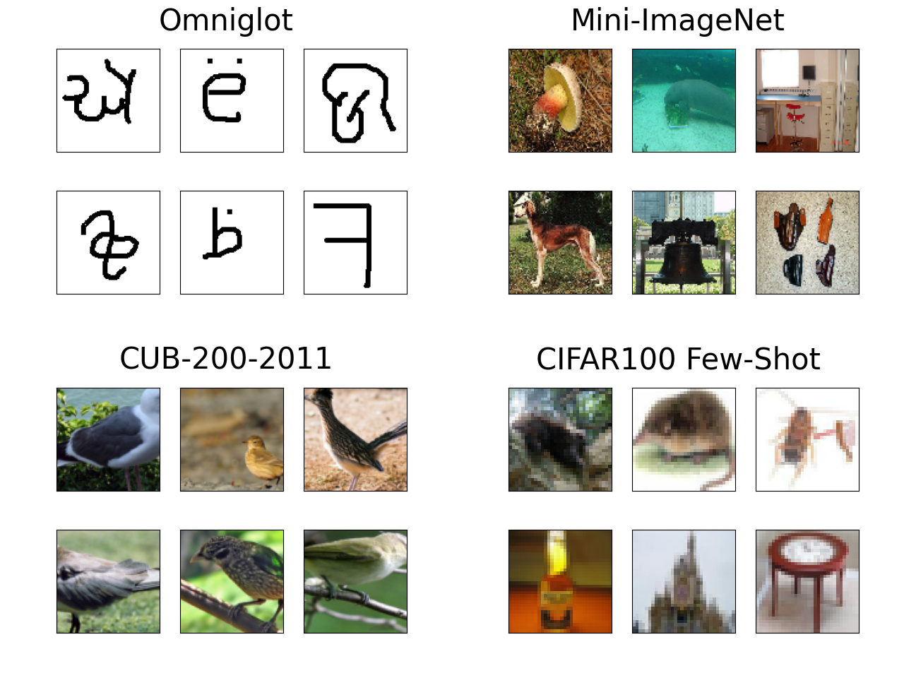

TripletMAML: A metric-based model-agnostic meta-learning algorithm for few-shot classification
## Citing TripletMAML
If you find PySlowFast useful in your research, please use the following BibTeX entry for citation.
```BibTeX
@misc{gulcu2025tripletmaml,
  author =       {Ayla Gülcü, Zeki Kuş, İsmail Taha Samed Özkan and Osman Furkan Karakuş},
  title =        {TripletMAML: A metric-based model-agnostic meta-learning algorithm for few-shot classification},
  howpublished = {\url{https://github.com/aylagulcu/TripletMAML}},
  journal =      {The Visual Computer}
  year =         {2025}
}
```


## Install & Dependencies
- python  == 3.9.7
- learn2learn == 0.1.7 
- numpy = 1.20.3  
- pytorch == 1.10.2  and  py3.9_cuda11.3_cudnn8.2.0_0 
- scikit-learn == 1.2.0

## Dataset Preparation

| Dataset | Download | Download Needed |
| ---     | ---      | ---             |
| Omniglot | [download](https://github.com/brendenlake/omniglot) | NO |
| MiniImageNet | [download](https://www.kaggle.com/datasets/arjunashok33/miniimagenet) | NO |
| CUB-200-2011 | [download](https://data.caltech.edu/records/65de6-vp158/files/CUB_200_2011.tgz?download=1) | YES |
| CIFAR Few-Shot | [download](https://drive.google.com/u/1/uc?id=1pTsCCMDj45kzFYgrnO67BWVbKs48Q3NI&export=download) | YES |

- for Omniglot
  ```
  TripletOmniglot.py Files will handle downloading automatically if download mode is set as True.
  ```
- for MiniImageNet
  ```
  ./data/MiniImageNet/MiniImageNet_downloader.py will handle downloading test-train-validation files accordingly. 
  No needed to install another dataset.
  ```
- for CUB-200-2011
  ```
  CUB-200-2011 files are needed to be downloaded from given link. Then replaced into corresponding folder which is ./data/CUB/
  Choose the generator of your preference so they can create the test-train-validation files accordingly.
  ```
- for CIFAR Few-Shot
  ```
  CIFAR Few-Shot files are needed to be downloaded from given link. Then replaced into corresponding folder which is ./data/CIFARFS100/
  First run the processor then you can use generator to create the test-train-validation files accordingly.
  ```

## Use
- for classification
  ```
  please look into ./TripletMAML/maml_triplet_train_test_val.py
  ```
- for retrieval
  ```
  please look into ./TripletMAML/maml_triplet_test_retrieval.py
  ```

## Directory Hierarchy
```
|—— .gitignore
|—— data
|    |—— Generators
|        |—— CIFARFS100
|            |—— CIFARFS100_generator.py
|            |—— CIFARFS100_processor.py
|        |—— CUB
|            |—— CUB_BB_NoResize_generator.py
|            |—— CUB_BB_Resize_generator.py
|            |—— CUB_NoBB_generator.py
|        |—— Flowers
|            |—— Flowers_generator.py
|        |—— MiniImageNet
|            |—— MiniImageNet_downloader.py
|—— HPO
|    |—— backbone.py
|    |—— de.py
|    |—— losses.py
|    |—— model.py
|    |—— rs.py
|    |—— train.py
|    |—— Triplets
|        |—— TripletCUB.py
|        |—— TripletFlowers.py
|        |—— TripletFSCIFAR100.py
|        |—— TripletMiniImageNet.py
|        |—— TripletOmniglot.py
|        |—— __init__.py
|—— TripletMAML
|    |—— backbone.py
|    |—— losses.py
|    |—— maml_triplet_test_retrieval.py
|    |—— maml_triplet_train_test_val.py
|    |—— TaskControl.ipynb
|    |—— Triplets
|        |—— TripletCUB.py
|        |—— TripletFlowers.py
|        |—— TripletFSCIFAR100.py
|        |—— TripletMiniImageNet.py
|        |—— TripletOmniglot.py
|        |—— __init__.py
```
## Code Details
### Tested Platform
- software
  ```
  OS: Ubuntu 20.04 LTS
  Python: 3.9.7 (anaconda)
  ```
- hardware
  ```
  CPU: Intel(R) Core(TM) i9-10850k CPU @3.60 GHz
  GPU: Nvidia RTX3090 (24GB)
  ```
